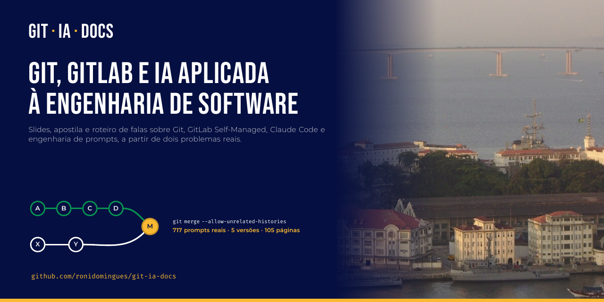

# git · ia · docs



**Git, GitLab e IA aplicada à Engenharia de Software**: uma capacitação interna que preparei e apresentei durante o meu estágio em Análise e Desenvolvimento de Sistemas na **Marinha do Brasil**. O material tem slides, apostila e roteiro de falas, e parte de dois problemas reais:

1. **Integrar um sistema que já tinha histórico Git a um GitLab Self-Managed** em que a `main` já existe e está protegida.
2. **Documentar sistemas legados com um agente de IA** (Claude Code), usando um prompt que evoluiu a partir das próprias falhas.

### 📖 **[Acessar o material publicado](https://andradasdev.github.io/git-ia/)**: apostila e slides no navegador

## O que tem aqui

| Pasta | Conteúdo |
|---|---|
| [`apresentacao/`](apresentacao/apresentacao.pdf) | 39 slides (16:9) para uma hora de exposição |
| [`apostila/`](apostila/apostila.pdf) | Apostila-guia de 56 páginas, para quem nunca usou Git, com exercícios e respostas |
| [`roteiro-de-falas/`](roteiro-de-falas/roteiro_de_falas.pdf) | O que falar em cada slide, com horário, gestos e frases de transição |
| [`model/SYSTEM_DOCUMENTATION.md`](model/SYSTEM_DOCUMENTATION.md) | O prompt final de engenharia reversa e documentação (42 seções, em inglês, com saída em PT-BR) |
| [`roteiro_versao_01.md`](roteiro_versao_01.md), [`roteiro_versão_final.md`](roteiro_versão_final.md) | O planejamento: os assuntos obrigatórios e o roteiro final |
| [`estilo/marinha-comum.tex`](estilo/marinha-comum.tex) | Tema LaTeX comum: cores do manual da marca, fontes e estilos TikZ para desenhar históricos Git |
| [`materials/manual-da-marca/`](materials/manual-da-marca/) | Manual de Identidade Visual da Marinha, a referência das cores e da tipografia |
| [`assets/`](assets/) | Fontes e imagens, com as licenças em [`assets/CREDITOS.md`](assets/CREDITOS.md) |
| [`divulgacao/`](divulgacao/) | Cards para o LinkedIn e para a prévia social do GitHub |

## Destaques

**Git e GitLab, do zero ao caso real**
- As três áreas do Git, branch como ponteiro, merge e como ler um conflito.
- Dois históricos sem ancestral comum resolvidos em 8 passos, de `git remote add` a `glab mr create`, com o erro real `refusing to merge unrelated histories`.
- A armadilha de `ours` e `theirs`, e por que os papéis se invertem no rebase.
- Um exercício que reproduz o caso inteiro sem servidor, usando um repositório *bare* no lugar do GitLab.
- Todos os comandos e saídas foram executados de verdade para montar o material.

**IA e engenharia de prompts, com dados**
- A evolução do prompt em 5 versões, medida no histórico real do Claude Code: 717 prompts em 123 sessões. O tamanho foi de 231 para 37.883 caracteres.
- Cada falha observada virou uma regra: saída em inglês, documentação superficial, lacunas preenchidas por palpite, risco de alterar código.
- Retrabalho estimado de cerca de 53% com prompts livres e de cerca de 25% com prompts estruturados. A amostra é pequena, e o material deixa isso claro.
- As três travas do prompt final:
  - fase de descoberta **somente leitura**;
  - **nunca inventar**, com rótulos como `DESCONHECIDO` e `REQUER VALIDAÇÃO` e a separação AS-IS / TO-BE / GAP;
  - protocolo **Safe Stop-and-Report**, com níveis STOP-P0 a P3.
- A IA tratada como ferramenta de engenharia: toda saída é validada contra o sistema real.

## Sobre esta versão pública

A publicação foi autorizada. Em relação ao material interno, esta versão:

- **não usa o logotipo da Marinha do Brasil**, e as pastas do logotipo e do distintivo do manual não estão incluídas;
- **não cita a organização militar** em que o estágio acontece;
- usa uma foto da Ilha das Cobras com licença livre (CC BY-SA 2.0).

Os sistemas institucionais citados aparecem anonimizados (Sistema A, B…), e o material não contém código, endereços nem dados internos. Este é um trabalho pessoal: não é publicação oficial da Marinha do Brasil.

## Publicação automática

Este é o repositório de **código**: tudo o que é pesado mora aqui. A cada push na `main`, o workflow [`.github/workflows/build.yml`](.github/workflows/build.yml):

1. compila a apresentação, a apostila e o roteiro de falas com XeLaTeX;
2. verifica se os PDFs saíram íntegros;
3. commita os PDFs de volta aqui;
4. envia a apostila, os slides e o card de prévia para [`andradasdev/git-ia`](https://github.com/andradasdev/git-ia), que publica o site no GitHub Pages.

O roteiro de falas não vai para o site: ele é a versão do apresentador. O envio usa o secret `GIT_IA_ANDRADASDEV`, e o passo a passo para criá-lo está em [`andradasdev/git-ia/documentacao`](https://github.com/andradasdev/git-ia/blob/main/documentacao/autenticacao-github-actions.md).

## Compilar

Os documentos usam XeLaTeX e só arquivos deste repositório (fontes incluídas):

```bash
cd apresentacao     && latexmk apresentacao.tex
cd apostila         && latexmk apostila.tex
cd roteiro-de-falas && latexmk roteiro_de_falas.tex
```

Cada pasta tem um `.latexmkrc` que já escolhe o XeLaTeX. É preciso ter uma distribuição TeX Live com `beamer`, `tcolorbox`, `pgfplots`, `fontawesome5` e `dirtree`.

## Licença

- Texto, slides e diagramas: [CC BY-NC-SA 4.0](LICENSE).
- Código LaTeX (`estilo/` e arquivos `.tex`): [MIT](LICENSE-CODE).
- Material de terceiros, incluindo o manual da marca: licença própria, listada em [`assets/CREDITOS.md`](assets/CREDITOS.md) e [`materials/manual-da-marca/`](materials/manual-da-marca/).

## Autor

**Ronivaldo D. Andrade**, estudante de Análise e Desenvolvimento de Sistemas: [github.com/ronidomingues](https://github.com/ronidomingues).

---

## English summary

A one-hour internal training kit, written in Brazilian Portuguese, with slides, a beginner's handbook and a speaker script. I built it during my Systems Analysis and Development internship at the **Brazilian Navy**. It covers **Git, GitLab and AI-assisted software engineering** through two real problems:

1. merging an existing local Git history into a self-managed GitLab repository whose `main` is protected and already initialized;
2. documenting legacy systems with an AI coding agent (Claude Code).

The handbook measures how the documentation prompt evolved across 5 versions, using 717 real prompts. Each observed failure became an explicit rule: read-only discovery, "never invent" with evidence labels, a Safe Stop-and-Report protocol, and mandatory Portuguese output. The final prompt is in [`model/`](model/).

Publication was authorized. This version does not use the Navy logo or name the specific military unit. It is personal work, not an official Navy publication.
